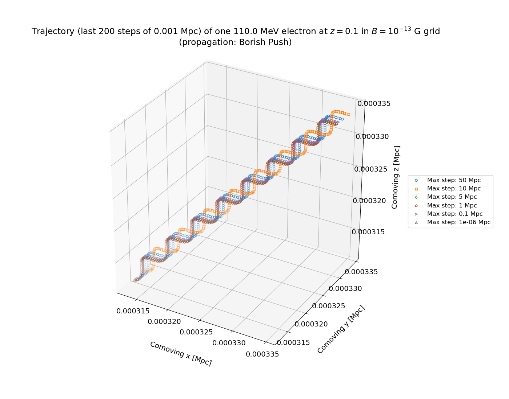
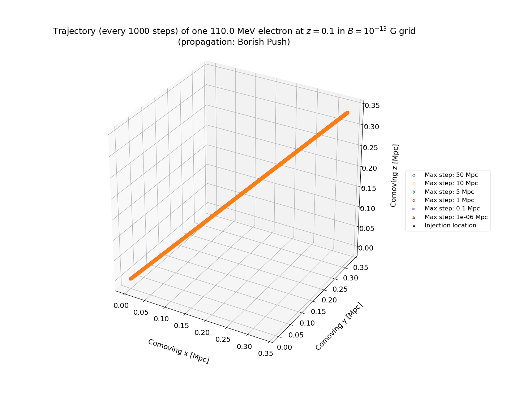
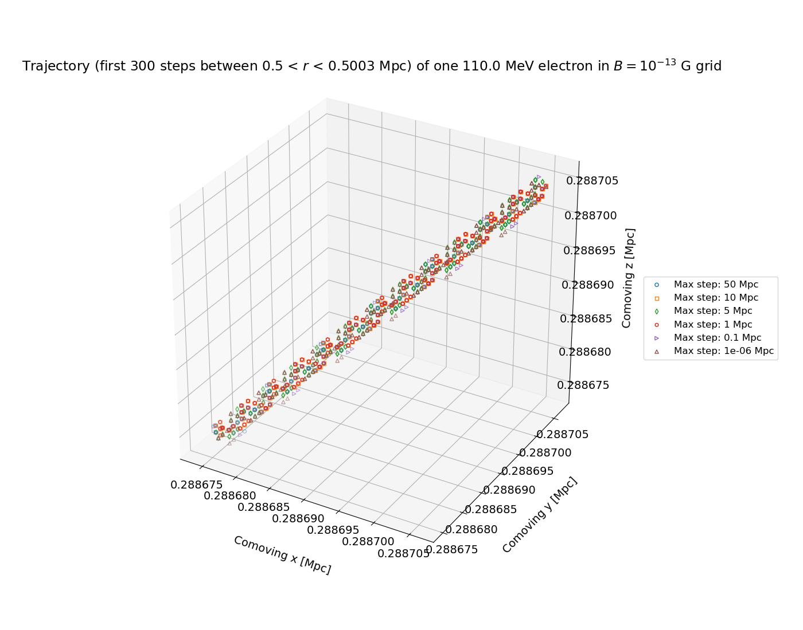
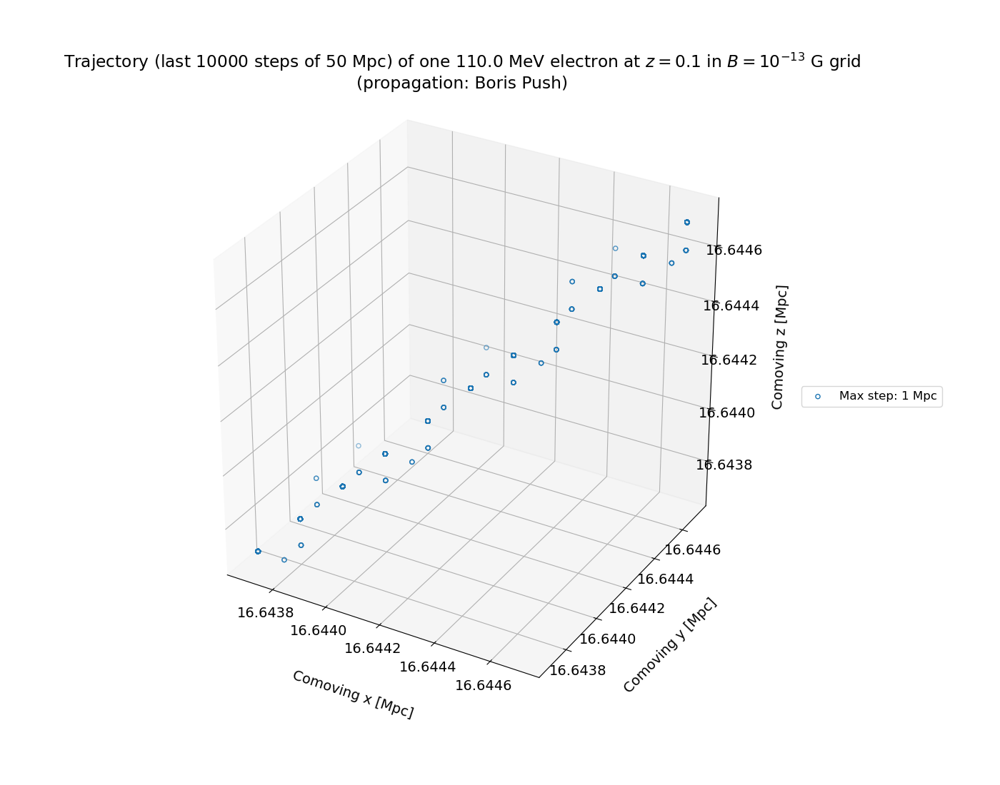
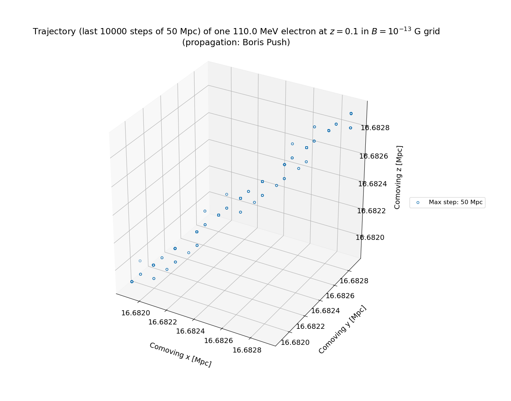
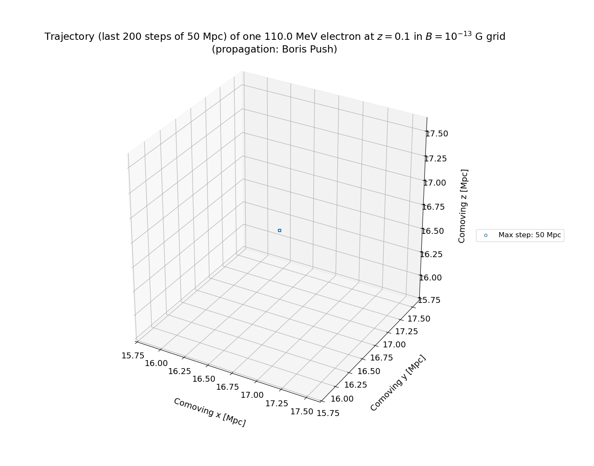

# `simcrpropa_step_size`

Explore impact of maximum step size on electron trajectory in magnetic field $B = 10^{-13}$ G where $\hat{B} = \dfrac{\hat{x} + \hat{y} + \hat{z}}{\sqrt{3}}$, in order to ensure the maximum step size is set appropriately such that it can resolve the Larmor radius of electrons and positrons.

Tested step sizes: 50, 10, 5, 1, 0.1, $10^{-6}$ Mpc. All resolve the Larmor radius for the lower energy electrons in our simulations (the smallest tracked energy is 100 MeV).

The start of the trajectory of the electron for various max step sizes:

The end of the trajectory of the electron for various max step sizes (the Larmor radius is resolved and the trajectories are out of phase):

The full trajectory (the maximum tracked trajectory is 1 Mpc):

Near the end of the trajectory, where $r = \sqrt{x^2 + y^2 + z^2}$ the Larmor radius is somewhat resolve, and the trajectories are out of phase:

Just one of the lines on the plot above is shown below:

Tracking a trajectory of 50 Mpc (which is the grid cell size):
Max step size 1 Mpc:

Max step size 50 Mpc:

