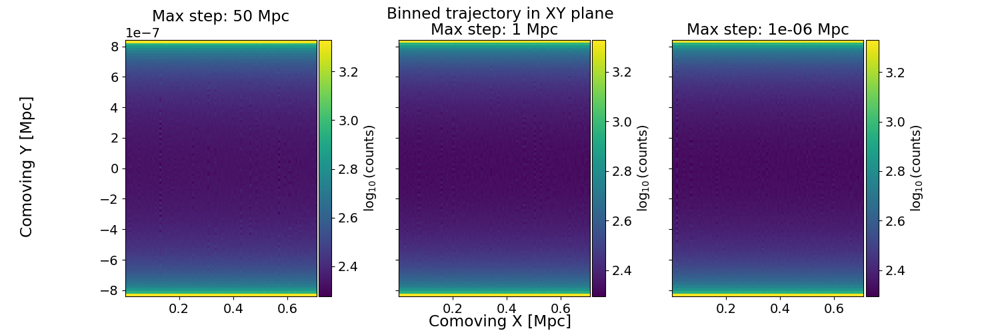

# `simcrpropa_step_size`

## Case: $\hat{B} = B\hat{x}, \vec{v} = c (\hat{x} + \hat{y})$

One electron is in a magnetic field $\hat{B} = B\hat{x}$ with $B = 10^{-13}$ G and the electron has initial velocity $\vec{v} = c (\hat{x} + \hat{y})$.  
The trajectory is tracked up to 1 Mpc.
The Larmor radius is resolved for all tested maximum step sizes. 
The expected Larmor radius of a 110 MeV electron in $B = 10^{-13}$ G is about 1 pc, so a maximum step size of 1 pc is expected to resolve the Larmor radius.

### 110 MeV electron

For 110 MeV electron, the expected Larmor radius is about 1 pc.
It is resolved for all tested maximum step sizes.
The trajectory is tracked up to 1 Mpc.

Note: 
* The electron at 110 MeV is just above the simulation break energy (100 MeV) so no noticablle evolution of the radius is expected to be observed with this particular simulation, because as the radius decreases so does the energy $E \propto r_L$ at which point the particle may be untracked.
* Many steps are needed to traverse the full perimeter.

### 1 TeV electron 

For 1 TeV electron, the expected Larmor radius is about 0.01 Mpc.
It is resolved for all tested maximum step sizes.
The trajectory is tracked up to 1 Mpc.

Note:
* Secondaries are expected to be tracked in this case because they do not quickly fall below the break energy of 100 MeV. 
* The electron loses energy via interactions so its energy and therefore Larmor radius are not fixed.
* The creation of cascades is via Monte Carlo methods so results are not expected to be identical.

---

### Cascades

### 110 MeV electron

### 1 TeV electron 

---

### Case: $\hat{B} = \dfrac{\hat{x} + \hat{y} + \hat{z}}{\sqrt{3}}, \vec{v} = c \hat{x}$

Explore impact of maximum step size on electron trajectory in magnetic field $B = 10^{-13}$ G where $\hat{B} = \dfrac{\hat{x} + \hat{y} + \hat{z}}{\sqrt{3}}$, in order to ensure the maximum step size is set appropriately such that it can resolve the Larmor radius of electrons and positrons.

Tested step sizes: 50, 10, 5, 1, 0.1, $10^{-6}$ Mpc. All resolve the Larmor radius for the lower energy electrons in our simulations (the smallest tracked energy is 100 MeV).

The start of the trajectory of the electron for various max step sizes:

The end of the trajectory of the electron for various max step sizes (the Larmor radius is resolved and the trajectories are out of phase):

The full trajectory (the maximum tracked trajectory is 1 Mpc):

Near the end of the trajectory, where $r = \sqrt{x^2 + y^2 + z^2}$ the Larmor radius is somewhat resolve, and the trajectories are out of phase:

Just one of the lines on the plot above is shown below:

